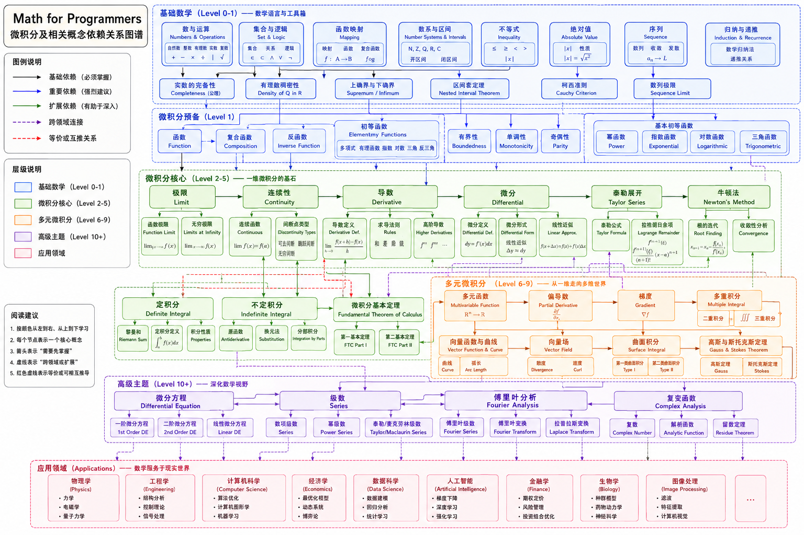

# Math for Programmers：程序员高等数学重学计划（Project Specification）

## 一、项目背景

大学阶段的高等数学课程，大多数采用"定义→定理→证明→例题"的组织方式。这种方式符合数学学科自身的发展逻辑，却未必符合第一次接触微积分的学习规律。很多学生并不是没有能力理解数学，而是在尚未建立直觉、问题背景和图像认知之前，就被要求接受大量抽象定义，因此容易形成"公式记忆"而不是"概念理解"。

本项目希望重新设计高等数学的学习路径，以**问题驱动（Problem Driven）**、**程序验证（Programming Verified）**、**图形理解（Visualization First）**、**工程应用（Engineering Oriented）**为核心思想，借助 Python、Marimo Notebook 与 AI 工具，构建一套适合程序员、工程师和 AI 从业者的现代数学学习体系。

本项目并非为了应付考试，而是希望真正建立数学思维，使数学成为分析问题、构建模型和理解 AI 技术的重要工具。

------

# 二、学习理念

## 2.1 成年人的学习方式

对于第一次真正理解一个数学概念，大脑真正希望得到的问题顺序通常不是教材中的组织方式，而应该是：

1. 为什么会有这个东西？
2. 现实世界遇到了什么问题？
3. 以前的方法为什么不能解决？
4. 数学家为什么提出这个概念？
5. 这个概念到底描述了什么？
6. 它对应的图像是什么？
7. 是否能够通过程序模拟？
8. 数学上如何精确定义？
9. 为什么一定要这样定义？
10. 它具有哪些重要性质？
11. 如何证明这些性质？

可以发现，**数学定义实际上应该排在理解过程的后半部分，而不是第一步。**

因此，本项目采用"先理解，再定义；先实验，再证明；先直觉，再抽象"的学习原则。

------

## 2.2 唯一主线：描述变化（Change）

整个微积分实际上只有一条核心主线：

> **如何描述变化（How to Describe Change）**

函数、极限、导数、积分、微分方程等内容，并不是彼此独立的知识，而是围绕"变化"这一核心问题逐步发展出来的数学工具。

因此，本项目不会把各章节作为孤立知识，而是始终围绕"变化"建立统一的知识体系。

------

# 三、总体学习阶段

整个学习过程划分为五个阶段，每个阶段解决不同层次的问题。

| 阶段     | 目标         | 重点                                     |
| -------- | ------------ | ---------------------------------------- |
| 第一阶段 | 建立直觉     | 图像、动画、现实问题、程序模拟           |
| 第二阶段 | 建立数学语言 | 定义、符号、数学表达                     |
| 第三阶段 | 建立推导能力 | 性质、证明、逻辑推导                     |
| 第四阶段 | 建立计算能力 | 数值计算、算法实现、Python 编程          |
| 第五阶段 | 建立工程应用 | AI、机器学习、图形学、优化算法等实际应用 |

五个阶段并不是五轮学习，而是每一个数学对象都会依次经历这五个层次。

------

# 四、整体学习路线

参考《Stewart Calculus（中文版第五版）》作为主要教材，《托马斯微积分》作为辅助教材，同时结合 MIT OpenCourseWare 的课程组织方式，对学习顺序进行重新设计。

| 阶段 | 数学主题                | 学习目标                   |
| ---- | ----------------------- | -------------------------- |
| 0    | 函数、图像、Python 绘图 | 建立后续所有知识的基础载体 |
| 1    | 极限                    | 理解无限逼近思想           |
| 2    | 连续                    | 理解函数何时保持连续变化   |
| 3    | 导数                    | 描述瞬时变化率             |
| 4    | 微分                    | 理解局部线性近似           |
| 5    | 泰勒展开                | 用多项式逼近函数           |
| 6    | 牛顿法                  | 第一个完整数学算法         |
| 7    | 定积分                  | 理解面积与累加思想         |
| 8    | 微积分基本定理          | 建立导数与积分统一关系     |
| 9    | 多元函数                | 从一维扩展到多维           |
| 10   | 偏导、梯度              | 理解 AI 中的梯度概念       |
| 11   | 最优化                  | 梯度下降与优化问题         |
| 12   | 微分方程                | 描述动态系统变化           |
| 13   | 无穷级数                | 函数逼近与收敛             |
| 14   | 傅里叶分析              | 信号、图像与频域分析       |

整个学习路线最终形成一条完整的发展链：

> 函数 → 极限 → 连续 → 导数 → 微分 → 泰勒 → 牛顿法 → 积分 → 微积分统一 → 多元函数 → 梯度 → 优化 → 微分方程 → 级数 → 傅里叶

它们的依赖关系如下：




------

# 五、每个数学对象统一学习模板

本项目采用"数学对象（Mathematical Object）"而不是"教材章节"作为知识组织方式。

每一个数学对象均遵循统一模板：

| 顺序 | 内容                          |
| ---- | ----------------------------- |
| 01   | Problem：为什么提出这个概念？ |
| 02   | History：历史背景             |
| 03   | Intuition：直觉理解           |
| 04   | Visualization：图像与动画     |
| 05   | Experiment：Python 数值实验   |
| 06   | Definition：数学定义          |
| 07   | Proof：推导与证明             |
| 08   | Application：工程应用         |
| 09   | Pitfalls：常见错误            |
| 10   | Summary：AI 总结与知识关联    |

这种组织方式保证整个知识体系具有统一结构，便于持续扩展。

------

# 六、知识组织方式（Ontology）

整个项目不是一本教材，而是一套数学知识库。

每一个知识对象都具有统一属性：

- 概念（Concept）
- 历史（History）
- 数学定义（Definition）
- 图像（Visualization）
- Python 实验（Experiment）
- 推导证明（Proof）
- 应用（Application）
- 与其它对象关系（Relation）
- 练习（Exercises）
- AI 总结（Summary）

知识对象之间形成依赖关系，例如：

Function → Limit → Continuity → Derivative → Differential → Integral → Gradient → Optimization

以后学习线性代数、概率论、机器学习、最优化等课程时，只需要继续增加新的知识对象，而无需重新组织整个工程。

------

# 七、项目目录（Marimo 版本）

本项目采用 Marimo Notebook 作为主要学习环境，因此 Notebook 是知识展示与实验的核心载体，Markdown 文档负责沉淀理论与总结。

```text
Math for Programmers/
├── README.md                      # 项目说明
├── pyproject.toml                 # Python 项目配置
├── uv.lock / requirements.txt
│
├── books/                         # 教材（不纳入版本控制）
│   ├── Stewart Calculus（中文第五版）
│   ├── 托马斯微积分.pdf
│   └── references.md
│
├── roadmap/                       # 学习规划
│   ├── roadmap.md
│   ├── schedule.md
│   └── progress.md
│
├── knowledge/                     # 数学知识对象（Ontology）
│   ├── Function/
│   ├── Limit/
│   ├── Continuity/
│   ├── Derivative/
│   ├── Differential/
│   ├── Taylor/
│   ├── NewtonMethod/
│   ├── Integral/
│   ├── FundamentalTheorem/
│   ├── Multivariable/
│   ├── Gradient/
│   ├── Optimization/
│   ├── DifferentialEquation/
│   ├── Series/
│   └── Fourier/
│
├── notebooks/                     # Marimo Notebook
│   ├── 00_function.py
│   ├── 01_limit.py
│   ├── 02_continuity.py
│   ├── ...
│
├── experiments/                   # 独立实验
│   ├── numerical/
│   ├── visualization/
│   ├── optimization/
│   └── simulation/
│
├── libs/                          # 自己实现的数学库
│
├── images/
├── datasets/
├── assets/
└── scripts/
```

------

# 八、知识对象目录规范

以 Derivative（导数）为例：

```text
knowledge/
└── Derivative/
    ├── README.md
    ├── concept.md
    ├── history.md
    ├── intuition.md
    ├── definition.md
    ├── proof.md
    ├── relation.md
    ├── applications.md
    ├── exercises.md
    ├── summary.md
    ├── references.md
    └── notebook.link
```

对应的 Marimo Notebook：

```text
notebooks/
└── 03_derivative.py
```

Notebook 负责：

- 图形演示
- Python 实验
- 动画
- 参数交互
- 数值验证
- AI 辅助讨论

Markdown 负责：

- 理论整理
- 推导记录
- 学习总结
- 阅读笔记

这样可以兼顾交互体验与知识沉淀。

------

# 九、学习计划（暑期 8 周）

| 周次    | 学习内容                              | 输出成果                          |
| ------- | ------------------------------------- | --------------------------------- |
| 第 1 周 | Python 绘图、函数、图像、数学预备知识 | Function Notebook、绘图库         |
| 第 2 周 | 极限、连续                            | Limit Notebook、连续性实验        |
| 第 3 周 | 导数、微分                            | Derivative Notebook、数值微分程序 |
| 第 4 周 | 泰勒展开、牛顿法                      | 泰勒可视化、牛顿法算法            |
| 第 5 周 | 定积分、微积分基本定理                | 数值积分实验                      |
| 第 6 周 | 多元函数、偏导、梯度                  | 梯度可视化、梯度下降程序          |
| 第 7 周 | 最优化、微分方程                      | 优化算法、欧拉法实验              |
| 第 8 周 | 无穷级数、傅里叶分析、综合项目        | 数学知识库第一版                  |

------

# 十、参考资料

## 主教材（Primary）

1. James Stewart，《Calculus Early Transcendentals》（中文版第五版）
   - 图像丰富
   - 工程导向明显
   - 概念解释优秀
   - 作为项目主线教材

## 辅助教材（Secondary）

1. 《托马斯微积分（Thomas' Calculus）》
   - 理论更加严谨
   - 提供不同的证明思路
   - 用于交叉验证概念理解

## 在线课程（Supplementary）

- MIT OpenCourseWare（Single Variable Calculus / Multivariable Calculus）

------

# 十一、项目最终目标

本项目最终目标不是完成一本高数笔记，也不是通过考试，而是构建一套可长期维护的数学知识工程。

它应当同时具备以下特征：

- **可阅读**：完整的理论说明与学习记录。
- **可计算**：所有核心概念均可通过 Python 验证。
- **可视化**：重要概念均提供动态图形或交互演示。
- **可扩展**：采用数学对象（Ontology）组织，可持续扩展到线性代数、概率论、优化理论、机器学习等领域。
- **可关联**：各数学对象之间形成统一的知识图谱，而非孤立章节。
- **可工程化**：以 Marimo Notebook 为实验平台，以 Markdown 为知识载体，以 Python 为验证工具，形成完整的现代数学学习工程。
